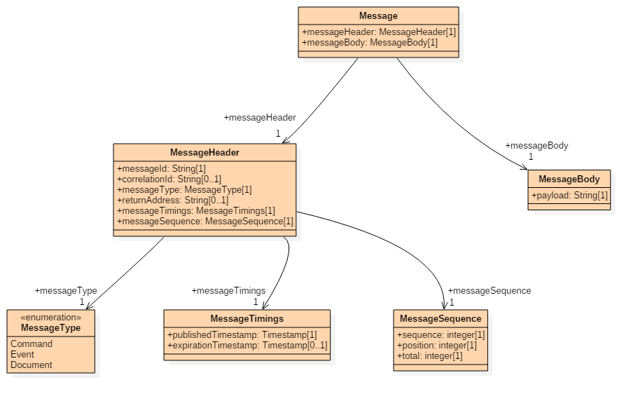

# RDSS Message API

This repository documents the RDSS Message API and describes the format and structure of messages sent within the RDSS project.

The API, format and structure draws on patterns from [Enterprise Integration Patterns](http://www.enterpriseintegrationpatterns.com/).

## Message Structure

The following diagram describes the message structure:

The diagram can be edited using [StarUML](http://staruml.io/). The source is provided in the [`model.mdj`](model.mdj) file.

## Operations

The following example operations are provided in the [`operations/`](operations/) folder:

- Metadata Operations:
 - [`metadata_create.md`](operations/metadata/README.md)
 - [`metadata_update.md`](operations/metadata/README.md)
