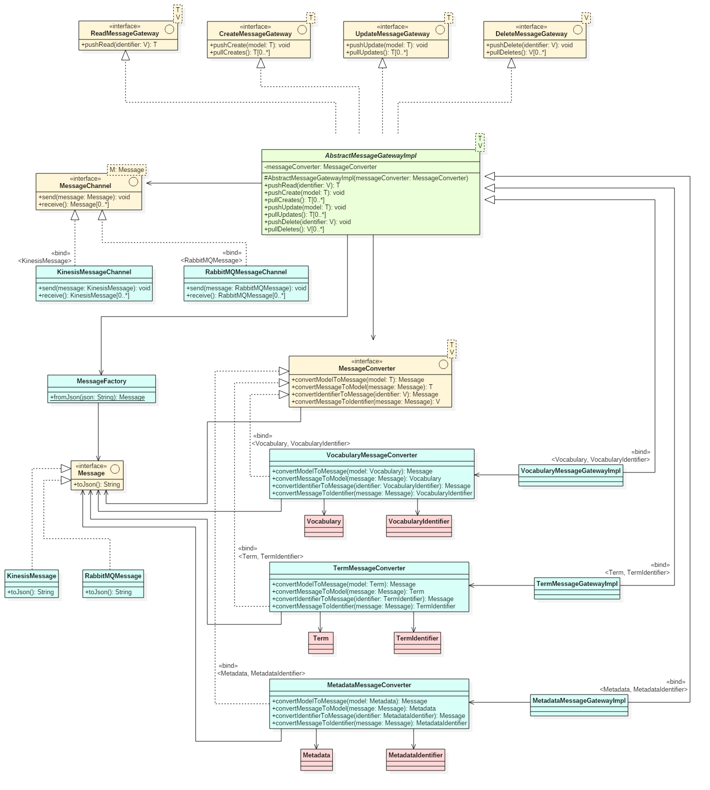

# RDSS Message API

- [Introduction](#introduction)
- [Message Structure](#message-structure)
- [Message Header](#message-header)
- [Message Body](#message-body)
- [Error Queues](#error-queues)
- [Audit Log](#audit-log)
- [Topology](#topology)
- [Transactional Behaviour](#transactional-behaviour)
- [Message Gateway & Channel Adapter](#message-gateway-channel-adapter)
- [Logging](#logging)
- [Application Error Codes](#application-error-codes)
- [Non-Functional Requirements](#non-functional-requirements)

## Introduction

This repository documents the RDSS Message API and describes the format and structure of messages sent within the RDSS project.

The API, format and structure draws on patterns from [Enterprise Integration Patterns](http://www.enterpriseintegrationpatterns.com/).

### Audience

The RDSS Message API is inteded for the following audience:

- Engineering
- Operations
- Quality Assurance

### Versioning

Current version:&nbsp;&nbsp;&nbsp;&nbsp;`0.0.1-SNAPSHOT`

Versioning for the RDSS Message API follows [Semantic Versioning 2.0.0](http://semver.org/spec/v2.0.0.html).

### Comformance

The keywords **MAY**, **MUST**, **MUST NOT**, **NOT RECOMMENDED**, **RECOMMENDED**, **SHOULD** and **SHOULD NOT** are to be interpreted as described in [RFC2219](https://tools.ietf.org/html/rfc2119).

## Message Structure

The following diagram describes the Message structure (the diagram can be edited using [StarUML](http://staruml.io/). The source is provided in the [`model/model.mdj`](model/model.mdj) file):

A Message is broken into two parts:
- The [Message Header](#message-header)
- The [Message Body](#message-body)

The standard encoding for a Message is [JSON](http://www.json.org/), and the examples provided in this documentation are given in this format.

The maximum size of a serialised JSON Message **MUST NOT** exceed 1000KB.

## Message Header

The Message Header contains important metadata descirbing the Message itself, including the type of Message, routing information, timings, sequencing, and so forth.

### `messageId`

- Multiplicity:&nbsp;&nbsp;&nbsp;&nbsp;`1`
- Type:&nbsp;&nbsp;&nbsp;&nbsp;&nbsp;&nbsp;&nbsp;&nbsp;&nbsp;&nbsp;&nbsp;&nbsp;&nbsp;&nbsp;`String`

System wide unique identifier describing the Message. It is expected that this will be a 128-bit [UUID](https://en.wikipedia.org/wiki/Universally_unique_identifier).

### `correlationId`

- Multiplicity:&nbsp;&nbsp;&nbsp;&nbsp;`0..1`
- Type:&nbsp;&nbsp;&nbsp;&nbsp;&nbsp;&nbsp;&nbsp;&nbsp;&nbsp;&nbsp;&nbsp;&nbsp;&nbsp;&nbsp;`String`

Provided on a return Message, containing the [`messageId`](#messageid) of the originally received Message.

### `messageType`

- Multiplicity:&nbsp;&nbsp;&nbsp;&nbsp;`1`
- Type:&nbsp;&nbsp;&nbsp;&nbsp;&nbsp;&nbsp;&nbsp;&nbsp;&nbsp;&nbsp;&nbsp;&nbsp;&nbsp;&nbsp;`MessageType`

One of `Command`, `Event` or `Document`.

### `returnAddress`

- Multiplicity:&nbsp;&nbsp;&nbsp;&nbsp;`0..1`
- Type:&nbsp;&nbsp;&nbsp;&nbsp;&nbsp;&nbsp;&nbsp;&nbsp;&nbsp;&nbsp;&nbsp;&nbsp;&nbsp;&nbsp;`String`

Describes the address to which the receiver should dispatch their return Message.

### `messageTimings`

- Multiplicity:&nbsp;&nbsp;&nbsp;&nbsp;`1`
- Type:&nbsp;&nbsp;&nbsp;&nbsp;&nbsp;&nbsp;&nbsp;&nbsp;&nbsp;&nbsp;&nbsp;&nbsp;&nbsp;&nbsp;`MessageTimings`

Contains any temporal information related to the Message.

#### `publishedTimestamp`

- Multiplicity:&nbsp;&nbsp;&nbsp;&nbsp;`1`
- Type:&nbsp;&nbsp;&nbsp;&nbsp;&nbsp;&nbsp;&nbsp;&nbsp;&nbsp;&nbsp;&nbsp;&nbsp;&nbsp;&nbsp;`Timestamp`

Describes the point in time in which the Message was dispatched.

#### `expirationTimestamp`

- Multiplicity:&nbsp;&nbsp;&nbsp;&nbsp;`0..1`
- Type:&nbsp;&nbsp;&nbsp;&nbsp;&nbsp;&nbsp;&nbsp;&nbsp;&nbsp;&nbsp;&nbsp;&nbsp;&nbsp;&nbsp;`Timestamp`

Describes the point in time when the Message expires.

### `messageSequence`

- Multiplicity:&nbsp;&nbsp;&nbsp;&nbsp;`1`
- Type:&nbsp;&nbsp;&nbsp;&nbsp;&nbsp;&nbsp;&nbsp;&nbsp;&nbsp;&nbsp;&nbsp;&nbsp;&nbsp;&nbsp;`MessageSequence`

Describes whether or not this Message is part of a larger sequence of Messages and, if so, where in that sequence it belongs.

#### `sequence`

- Multiplicity:&nbsp;&nbsp;&nbsp;&nbsp;`1`
- Type:&nbsp;&nbsp;&nbsp;&nbsp;&nbsp;&nbsp;&nbsp;&nbsp;&nbsp;&nbsp;&nbsp;&nbsp;&nbsp;&nbsp;`String`

System wide unique identifier that distinguishes this sequence of Messages from others. It is expected that this will be a 128-bit [UUID](https://en.wikipedia.org/wiki/Universally_unique_identifier).

#### `position`

- Multiplicity:&nbsp;&nbsp;&nbsp;&nbsp;`1`
- Type:&nbsp;&nbsp;&nbsp;&nbsp;&nbsp;&nbsp;&nbsp;&nbsp;&nbsp;&nbsp;&nbsp;&nbsp;&nbsp;&nbsp;`Integer`

Position in the sequence of Messages where this Message belongs.

#### `total`

- Multiplicity:&nbsp;&nbsp;&nbsp;&nbsp;`1`
- Type:&nbsp;&nbsp;&nbsp;&nbsp;&nbsp;&nbsp;&nbsp;&nbsp;&nbsp;&nbsp;&nbsp;&nbsp;&nbsp;&nbsp;`Integer`

Total number of Messages in this sequence.

### `messageHistory`

- Multiplicity:&nbsp;&nbsp;&nbsp;&nbsp;`0..*`
- Type:&nbsp;&nbsp;&nbsp;&nbsp;&nbsp;&nbsp;&nbsp;&nbsp;&nbsp;&nbsp;&nbsp;&nbsp;&nbsp;&nbsp;`MessageHistory`

Describes the route that this Message has taken, up to and including this point in time.

#### `machineId`

- Multiplicity:&nbsp;&nbsp;&nbsp;&nbsp;`1`
- Type:&nbsp;&nbsp;&nbsp;&nbsp;&nbsp;&nbsp;&nbsp;&nbsp;&nbsp;&nbsp;&nbsp;&nbsp;&nbsp;&nbsp;`String`

The ID of the machine that generated the history entry.

#### `machineAddress`

- Multiplicity:&nbsp;&nbsp;&nbsp;&nbsp;`1`
- Type:&nbsp;&nbsp;&nbsp;&nbsp;&nbsp;&nbsp;&nbsp;&nbsp;&nbsp;&nbsp;&nbsp;&nbsp;&nbsp;&nbsp;`String`

The hostname, IP address, or other identifying network address of the machine that generated the history entry.

#### `timestamp`

- Multiplicity:&nbsp;&nbsp;&nbsp;&nbsp;`1`
- Type:&nbsp;&nbsp;&nbsp;&nbsp;&nbsp;&nbsp;&nbsp;&nbsp;&nbsp;&nbsp;&nbsp;&nbsp;&nbsp;&nbsp;`Timestamp`

The timestamp at which the history entry was generated.

## Message Body

### JSON Schema

The following JSON schemas are provided as part of this project, which fully describe the associated [Data Model](https://github.com/JiscRDSS/rdss-canonical-data-model):

- [`schemas/research_object.json`](schemas/research_object.json)
- [`schemas/material_asset.json`](schemas/material_asset.json)
- [`schemas/intellectual_asset.json`](schemas/intellectual_asset.json)
- [`schemas/enumeration.json`](schemas/enumeration.json) - *Note that enumeration values are provided for reference only. Enumerations* ***MUST*** *be referenced using their respective ID values.*

The schemas can be used to assist in development and validation of JSON objects that represent payloads, which are described in this API. Additionally, they are also used within the [`message-api-schema-validator/`](message-api-schema-validator/) tool, which validates the example payload JSON objects described in the [`messages/`](messages/) folder.

Currently, all JSON schemas IDs (including `$ref` declarations within the schemas) are namespaced under `https://www.jisc.ac.uk/rdss/schema/`. However, consumers of the schemas should not expect the schemas to be available at the URLs represented by these IDs.

### Messages

The following example Messages are provided in the [`messages/`](messages/) folder:

| Message    | Read                                                     | Create                                                       | Update                                                       | Delete                                                       |
|------------|----------------------------------------------------------|--------------------------------------------------------------|--------------------------------------------------------------|--------------------------------------------------------------|
| Vocabulary | [`messages/vocabulary/read/`](messages/vocabulary/read/) | [`messages/vocabulary/create/`](messages/vocabulary/create/) | [`messages/vocabulary/update/`](messages/vocabulary/update/) | [`messages/vocabulary/delete/`](messages/vocabulary/delete/) |
| Term       | [`messages/term/read/`](messages/term/read/)             | [`messages/term/create/`](messages/term/create/)             | [`messages/term/update/`](messages/term/update/)             | [`messages/term/delete/`](messages/term/delete/)             |
| Metadata   | [`messages/metadata/read/`](messages/metadata/read/)     | [`messages/metadata/create/`](messages/metadata/create/)     | [`messages/metadata/update/`](messages/metadata/update/)     | [`messages/metadata/delete/`](messages/metadata/delete/)     |

In all instances where a response is required, the [`correlationId`](#correlationid) **MUST** be provided in the header of the Message and **MUST** match the [`messageId`](#messageid) provided in the original request.

## Error Queues

### Invalid Message Queue

If a receiver receives a Message it cannot process, it **SHOULD** move the invalid Message to an Invalid Message Queue.

Each machine that is capable of receiving Messages **MUST** also maintain a local Invalid Message Queue. The receiver is responsible for processing the Message and determining its validity, and as a result of this, moving the Message to the Invalid Message Queue should it be determined that the Message is invalid.

#### Invalid Message Error Codes

The following tables describes the exhaustive list of error codes for invalid Messages:

| Error Code   | Description                                                                                 |
|--------------|---------------------------------------------------------------------------------------------|
| QUEUEINVL001 | The [`Message Body`](#message-body) is not in the expected format.                          |
| QUEUEINVL002 | The provided [`messageType`](#messagetype) is not supported.                                |
| QUEUEINVL003 | The expiration date of the Message had passed at the point at which delivery was attempted. |
| QUEUEINVL004 | Invalid or corrupt headers were detected on the Message.                                    |

## Audit Log

The Audit Log is a destination for Messages that every Message sent through the system will arrive at.

It is delivered in the form of an [AWS Kinesis Firehose](https://aws.amazon.com/kinesis/firehose/), which in turn loads the data into an [Aamzon S3](https://aws.amazon.com/s3/). The data is then made available for consumption and processing by other systems (e.g reporting).

In order for a Message to be consumed by the Audit Log, Messages **MUST** be in serialised JSON format and **MUST NOT** exceed 1000KB.

## Topology

The following diagram describes the topology of the Messaging system (the diagram can be edited using [Microsoft Visio](https://products.office.com/en-gb/visio/flowchart-software). The source is provided in the [`topology/topology.vsdx`](topology/topology.vsdx) file.)

The following stencils are used in the creation of the diagram:

- [Hohpe EID Stencils](http://www.enterpriseintegrationpatterns.com/downloads.html)
- [Amazon AWS Stencils](https://aws.amazon.com/architecture/icons/)

- [Message Routers](http://www.enterpriseintegrationpatterns.com/patterns/messaging/MessageRouter.html) and [Channel Adapters](http://www.enterpriseintegrationpatterns.com/patterns/messaging/ChannelAdapter.html) are implemented as [AWS Lambda](https://aws.amazon.com/lambda/) services.
- [Message Channels](http://www.enterpriseintegrationpatterns.com/patterns/messaging/MessageChannel.html) are implemented using [AWS Kinesis Streams](https://aws.amazon.com/kinesis/streams/).
- Firehoses are implemented using [AWS Kinesis Firehose](https://aws.amazon.com/kinesis/firehose/).
- Logs are implemented using [Amazon S3](https://aws.amazon.com/s3/).

## Transactional Behaviour

All clients **MUST** implement transactional behaviour, such that any message consumed by a receiver will not be regarded as consumed until the client commits receipt of that message back to the sender / queue.

For example, a client can consume a message without actually removing it from the channel. Should the client crash or fail to process the message, the message still exists on the queue after the client recovers. Once the receiver processes the message and is certain that it wants to consume the message, the client will commit the transaction and the message will be removed the queue.

## Message Gateway & Channel Adapter

The messaging system offers applications who wish to send and receive messages two mechanisms of interaction: a [Message Gateway](http://www.enterpriseintegrationpatterns.com/patterns/messaging/MessagingGateway.html) and a [Channel Adapter](http://www.enterpriseintegrationpatterns.com/patterns/messaging/ChannelAdapter.html).

The Message Gateway offers the preferred interface to the messaging system. It exists within the application itself and encapsulates the code specific to the messaging system whilst exposing APIs for interaction.

The alternative interface to the messaging system is the Channel Adapter, which does not require code implementation as part of the application. Instead, the Channel Adapter exists as a separate component and exposes a REST API to applications

## Logging

All applications which interact with the messaging system **MUST** implement a logging mechanism that, at a minimum, conforms with the following requirements:

| Log Level | Description |
| --------- | ----------- |
| `DEBUG`   | Information that is useful to developers, engineers and system support staff, and can provide additional context and information on the flow of execution through the code leading up to a higher log level.
| `INFO`    | Information that is significant / important, but is expected under normal operating conditions, such as services starting, stopping and initialising, or completion of significant transactions.
| `WARN`    | Events that may present a problem but have generally been accounted for in the execution of code. These do not directly impact the operation of the application and thus do not require immediate attention.
| `ERROR`   | A situation that should never have occurred and represents a signficant problem within the application. It is expected that such situations would require the immediate attention of an engineer or system support staff.
| `FATAL`   | An overall application failure has occurred, which has resulted in the unexpected termination of one or services.

All Messages sent and received by the application **MUST** be logged and **MUST** have the following details logged:
- The name of the channel that the message was sent to, or received from.
 The date and time at which the message was sent or received by the application.
- All Message Headers, in the format of `key : value`.
- The entire Message Body, in JSON format. This **MAY** be minified, but **SHOULD** be pretty-printed for the purposes of easier consumption by a human.

All log entries **MUST** have a corresponding timestamp that describes the date and time in which the log entry was created, and **MUST** have millisecond precision.

Applications **MUST** retain log entries for a minimum of 365 days from the date that the log file was generated, but **SHOULD** retain them for as long as is feasible, given storage and maintenance constraints.

## Application Error Codes

The following sections describe the error codes that an application may raise in relation to the Messages it receives. These are separate from [Invalid Message Error Codes](#invalid-message-error-codes), which represent errors that may occur with the delivery of a Message.

### Generic Error Codes

| Error Code  | Description                                              |
|-------------|----------------------------------------------------------|
| `APPERR001` | An error occurred interacting with the repository.       |
| `APPERR002` | Invalid JSON structure detected in the Message Body.     |
| `APPERR003` | A required header was not present in the Message Header. |
| `APPERR004` | A required field was not present in the Message Body.    |
| `APPERR005` | Failed to roll back transaction.                         |
| `APPERR006` | An unexpected error occurred.                            |

### Metadata Error Codes

| Error Code     | Description                                                            |
|----------------|------------------------------------------------------------------------|
| `APPERRMET001` | Received a Metadata `UPDATE` with a `datasetUuid` that does not exist. |
| `APPERRMET002` | Received a Metadata `DELETE` with a `datasetUuid` that does not exist. |

### Vocabulary Error Codes

| Error Code     | Description                                                               |
|----------------|---------------------------------------------------------------------------|
| `APPERRVOC001` | Received a Vocabulary `UPDATE` with a `vocabularyId` that does not exist. |
| `APPERRVOC002` | Received a Vocabulary `DELETE` with a `vocabularyId` that does not exist. |

### Term Error Codes

| Error Code     | Description                                                                               |
|----------------|-------------------------------------------------------------------------------------------|
| `APPERRTER001` | Received a Term `UPDATE` with a `vocabularyId` that does not exist.                       |
| `APPERRTER002` | Received a Term `UPDATE` with a `termId` that does not exist in the given `vocabularyId`. |
| `APPERRTER003` | Received a Term `DELETE` with a `vocabularyId` that does not exist.                       |
| `APPERRTER004` | Received a Term `DELETE` with a `termId` that does not exist in the given `voabularyId`.  |

## Non-Functional Requirements

### Messages

| Requirement  | Value  | Description                                                                                |
|--------------|--------|--------------------------------------------------------------------------------------------|
| Message Size | 1000KB | AWS Kinesis Firehose and AWS Kinesis Streams imposes a maximum size of 1000KB per message. |

### Message Channels

| Requirement  | Value                             | Description                                                                                                                                                                          |
|--------------|-----------------------------------|--------------------------------------------------------------------------------------------------------------------------------------------------------------------------------------|
| Time To Live | 168 hours                         | AWS Kinesis Stream has a maximum retention period of 168 hours, thereby giving our Message Channels a TTL of 168 hours.                                                              |
| Throughput   | Per shard: 1MB/s in and 4MB/s out | Each AWS Kinesis Stream can by default support up to 50 shards in US East, ES West and EU Ireland, and 25 shards in other regions. These values can be increased with justification. |

### Audit Logs & Invalid Message Channels

| Requirement   | Value                                                  | Description                                                                                                                                                       |
|---------------|--------------------------------------------------------|-------------------------------------------------------------------------------------------------------------------------------------------------------------------|
| Account Limit | 20 per region                                          | A single AWS account can have a maximum of 20 AWS Kinesis Firehose delivery streams per region.                                                                   |
| Time To Live  | 24 hours with a retry of 0 to 7200 seconds             | Should the delivery destination be unavailable, AWS Kinesis Firehose will retain records for a maximum of 24 hours and can retry delivery from 0 to 7200 seconds. |
| Throughput    | 200 transactions/second, 5000 records/second and 5MB/s | These values can be increased with justification.                                                                                                                 |
| Buffer        | 1MB to 128MB and 60 to 900 seconds                     | Buffer sizes can range from 1MB to 128MB with intervals of 60 to 900 seconds.                                                                                     |
| Compression   | GZIP, ZIP and SNAPPY                                   | Data provided to the AWS Kinesis Firehose can be compressed using GZIP, ZIP and SNAPPY. However, the uncompressed size cannot exceeed 1000KB.                     |
