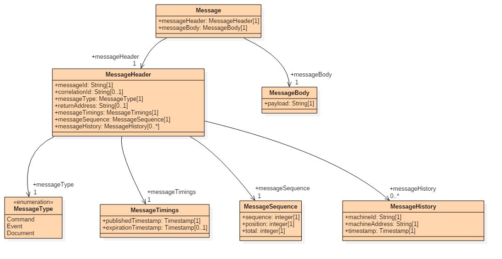
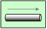
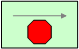
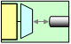
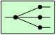
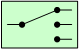
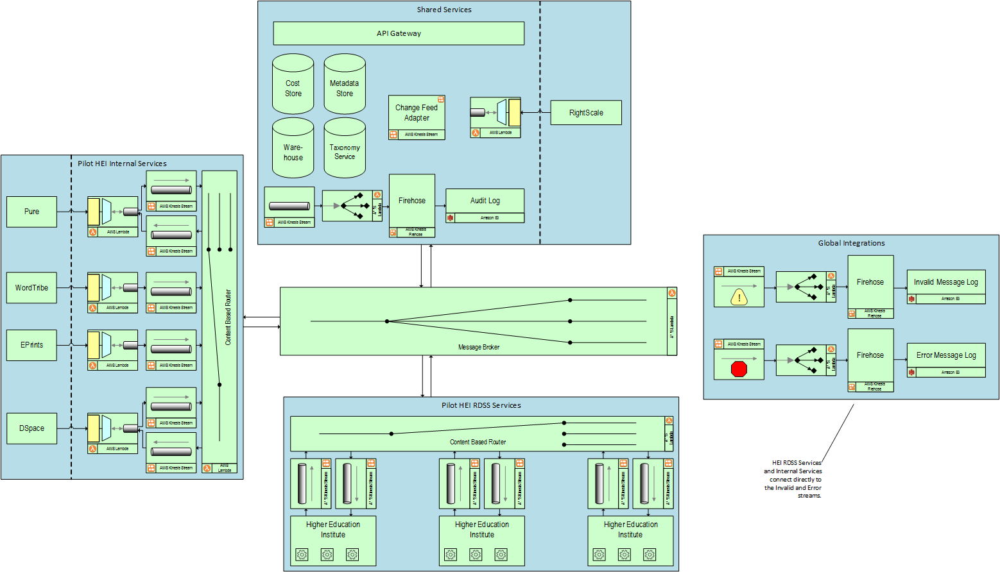
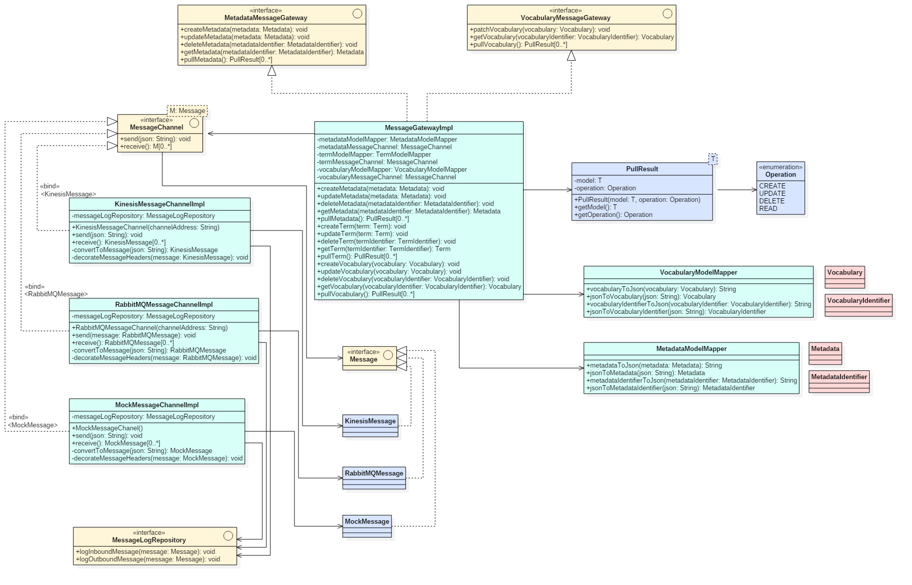
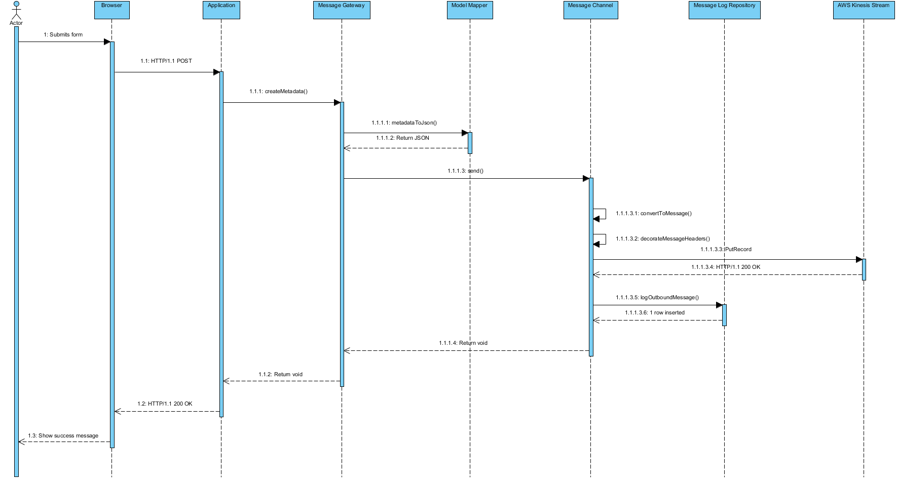
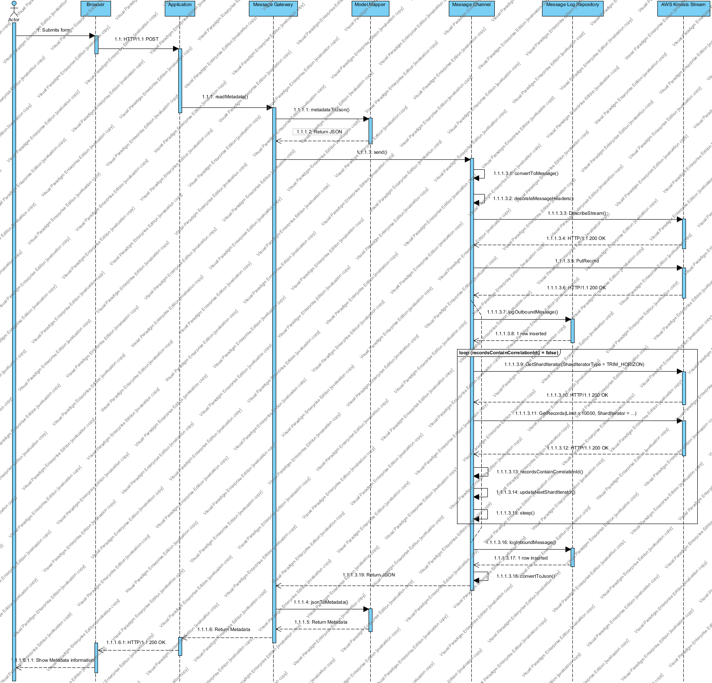

# RDSS Message API

- [Introduction](#introduction)
- [Message Structure](#message-structure)
- [Message Header](#message-header)
- [Message Body](#message-body)
- [Object Versioning](#object-versioning)
- [Message Triggers](#message-triggers)
- [Messaging Receiving](#messaging-receiving)
- [File Download Behaviour](#file-download-behaviour)
- [Multi-Message Sequence](#multi-message-sequence)
- [Error Queues](#error-queues)
- [Error Codes](#error-codes)
- [Audit Log](#audit-log)
- [Topology](#topology)
- [Transactional Behaviour](#transactional-behaviour)
- [Local Data Repository](#local-data-repository)
- [Network Failure Behaviour](#network-failure-behaviour)
- [Message Gateway & Channel Adapter](#message-gateway-channel-adapter)
- [Logging](#logging)
- [Non-Functional Requirements](#non-functional-requirements)

## Introduction

This repository documents the RDSS Message API and describes the format and structure of Messages sent within the RDSS project, and architectural designs and patterns for the underlying messaging system.

The API, format, structures and patterns are derived from material from [Enterprise Integration Patterns](http://www.enterpriseintegrationpatterns.com/).

### Audience

The RDSS Message API is intended for the following audience:

- Engineering
- Operations
- Quality Assurance

### Versioning

- Specification version:&nbsp;&nbsp;`1.2.2-SNAPSHOT`
- Data model version:&nbsp;&nbsp;&nbsp; [`1.1.0`](https://github.com/JiscRDSS/rdss-canonical-data-model/tree/1.1.0)

Releases of this specification can be found under [Releases](https://github.com/JiscRDSS/rdss-message-api-docs/releases). Vendors **MUST** implement against a release - all other branches are considered in a constant state of flux and **MAY** change at any time.

The versioning scheme of this specification follows [Semantic Versioning 2.0.0](http://semver.org/spec/v2.0.0.html) (also known as SemVer). Using SemVer, the version number is given in the format of `MAJOR.MINOR.PATH`, where:

- `MAJOR` version changes contain non-compatible API changes.
- `MINOR` version changes contain backwards compatible enhancements.
- `PATCH` version changes contain backwards compatible bugfixes.

Vendors implementing this specification **SHOULD** make a best effort to implement all `MINOR` and `PATCH` changes as and when they are made available. The implementation and release of `MAJOR` changes however **MUST** be coordinated with maintainers of the messaging system to ensure compatibility between this API and the messaging system itself.

The version of this specification used to generate a given Message can be determined by inspecting the `version` header (as described in the [Message Header](#message-header)) section.

### Comformance

The keywords **MAY**, **MUST**, **MUST NOT**, **NOT RECOMMENDED**, **RECOMMENDED**, **SHOULD** and **SHOULD NOT** are to be interpreted as described in [RFC2119](https://tools.ietf.org/html/rfc2119).

## Message Structure

The following diagram describes the Message structure (the diagram can be edited using [StarUML](http://staruml.io/). The source is provided in the [`model/model.mdj`](model/model.mdj) file):



A Message is broken into two parts:
- The [Message Header](#message-header)
- The [Message Body](#message-body)

A complete example of a Message can be found [here](messages/example.json).
The JSON schema for a complete message can be found [here](messages/message_schema.json)

The standard encoding for a Message is [JSON](http://www.json.org/), and the examples provided in this documentation are given in this format.

The maximum size of a serialised JSON Message **MUST NOT** exceed 1000KB.

### Data Types

#### UUID

The purpose of using a UUID is to reasonably guarantee that disparate and unconnected systems can independently generate identifiers without the requirement of a centralised registry to ensure conflicts and duplicates do not occur.

All references to UUID (universally unique identifier) in this specification refer explicitly to a 128-bit number - sometimes also referred to as a GUID (globally unique identifier) - represented in a textual format consisting of five groups separated by hyphens in the form `8-4-4-4-12`, providing for a total of 36 characters (32 alphanumeric characters and four hyphens).

Producers of Messages for publication are free to choose from any of the UUID versions described in [RFC4122](https://tools.ietf.org/html/rfc4122) when generating UUIDs, under the assumption that the implementation used to generate the UUID is _sufficiently random_ so as to guarantee that the probability of generating a duplicate is low enough to be negligible. In this regard, developers **SHOULD** defer to language specific SDKs or established third-party libraries for this functionality.

The following block of code demonstrates how to generate UUIDs using Python:

```python
import uuid

uuid.uuid1()
UUID('bc0ca89e-a90d-11e7-9537-f859711e6643')

uuid.uuid3(uuid.NAMESPACE_DNS, 'python.org')
UUID('6fa459ea-ee8a-3ca4-894e-db77e160355e')

uuid.uuid4()
UUID('00578f5d-bca4-4e46-a48a-3739db0070ec')

uuid.uuid5(uuid.NAMESPACE_DNS, 'python.org')
UUID('886313e1-3b8a-5372-9b90-0c9aee199e5d')
```

The following regular expression **MAY** be adopted by both producers and consumers in order to validate a UUID:

```
^[0-9a-f]{8}-[0-9a-f]{4}-[1-5][0-9a-f]{3}-[89ab][0-9a-f]{3}-[0-9a-f]{12}$
```

Should a consumer encounter an invalid UUID on a Message, that Message **MUST** be moved to the [Invalid Message Queue](#invalid-message-queue) with the error code [`GENERR010`](#general-error-codes).

#### Timestamp

All timestamps provided as part of a JSON payload **MUST** be provided in [RFC3339](https://tools.ietf.org/html/rfc3339) format and **MUST** contain both the date and time component:

- Complete date plus hours, minutes and seconds:
    - `YYYY-MM-DDThh:mm:ssTZD` (e.g. `1997-07-16T19:20:30+01:00`)
- Complete date plus hours, minutes, seconds and a decimal fraction of a second:
    - `YYYY-MM-DDThh:mm:ss.sTZD` (e.g. `1997-07-16T19:20:30.45+01:00`)

_Note with regards to the timezone component of a timestamp, for the purposes of clarity this **MUST** be provided in all instances, either with the UTC designation `Z` or as an hours and minutes offset, e.g. `+01:00`._

#### Email Address

All email addresses provided as part of a JSON payload **MUST** be provided in [RFC5322 Section 3.4.1](https://tools.ietf.org/html/rfc5322#section-3.4.1) format.

## Message Header

The Message Header contains important metadata describing the Message itself, including the type of Message, routing information, timings, sequencing, and so forth.

An example Message Header can be found [here](messages/header/example.json).
The JSON schema of the Message Header can be found [here](messages/header/header_schema.json).

### `messageId`

- Multiplicity:&nbsp;&nbsp;&nbsp;&nbsp;`1`
- Type:&nbsp;&nbsp;&nbsp;&nbsp;&nbsp;&nbsp;&nbsp;&nbsp;&nbsp;&nbsp;&nbsp;&nbsp;&nbsp;&nbsp;`String`

System wide unique identifier describing the Message, as described in the [UUID](#uuid) section.

### `correlationId`

- Multiplicity:&nbsp;&nbsp;&nbsp;&nbsp;`0..1`
- Type:&nbsp;&nbsp;&nbsp;&nbsp;&nbsp;&nbsp;&nbsp;&nbsp;&nbsp;&nbsp;&nbsp;&nbsp;&nbsp;&nbsp;`String`

Provided on a return Message, containing the [`messageId`](#messageid) of the originally received Message.

### `messageClass`

- Multiplicity:&nbsp;&nbsp;&nbsp;&nbsp;`1`
- Type:&nbsp;&nbsp;&nbsp;&nbsp;&nbsp;&nbsp;&nbsp;&nbsp;&nbsp;&nbsp;&nbsp;&nbsp;&nbsp;&nbsp;`MessageClass`

One of `Command`, `Event` or `Document`.

### `messageType`

- Multiplicity:&nbsp;&nbsp;&nbsp;&nbsp;`1`
- Type:&nbsp;&nbsp;&nbsp;&nbsp;&nbsp;&nbsp;&nbsp;&nbsp;&nbsp;&nbsp;&nbsp;&nbsp;&nbsp;&nbsp;`MessageType`

Describes the type of Message, in the format of `<Type><Operation>` and is described in the [Message Body](#message-body) section.

### `returnAddress`

- Multiplicity:&nbsp;&nbsp;&nbsp;&nbsp;`0..1`
- Type:&nbsp;&nbsp;&nbsp;&nbsp;&nbsp;&nbsp;&nbsp;&nbsp;&nbsp;&nbsp;&nbsp;&nbsp;&nbsp;&nbsp;`String`

Describes the address to which the receiver should dispatch their return Message.

### `messageTimings`

- Multiplicity:&nbsp;&nbsp;&nbsp;&nbsp;`1`
- Type:&nbsp;&nbsp;&nbsp;&nbsp;&nbsp;&nbsp;&nbsp;&nbsp;&nbsp;&nbsp;&nbsp;&nbsp;&nbsp;&nbsp;`MessageTimings`

Contains any temporal information related to the Message.

#### `publishedTimestamp`

- Multiplicity:&nbsp;&nbsp;&nbsp;&nbsp;`1`
- Type:&nbsp;&nbsp;&nbsp;&nbsp;&nbsp;&nbsp;&nbsp;&nbsp;&nbsp;&nbsp;&nbsp;&nbsp;&nbsp;&nbsp;`Timestamp`

Describes the point in time in which the Message was dispatched.

#### `expirationTimestamp`

- Multiplicity:&nbsp;&nbsp;&nbsp;&nbsp;`0..1`
- Type:&nbsp;&nbsp;&nbsp;&nbsp;&nbsp;&nbsp;&nbsp;&nbsp;&nbsp;&nbsp;&nbsp;&nbsp;&nbsp;&nbsp;`Timestamp`

Describes the point in time when the Message expires.

### `messageSequence`

- Multiplicity:&nbsp;&nbsp;&nbsp;&nbsp;`1`
- Type:&nbsp;&nbsp;&nbsp;&nbsp;&nbsp;&nbsp;&nbsp;&nbsp;&nbsp;&nbsp;&nbsp;&nbsp;&nbsp;&nbsp;`MessageSequence`

Describes whether or not this Message is part of a larger sequence of Messages and, if so, where in that sequence it belongs.

#### `sequence`

- Multiplicity:&nbsp;&nbsp;&nbsp;&nbsp;`1`
- Type:&nbsp;&nbsp;&nbsp;&nbsp;&nbsp;&nbsp;&nbsp;&nbsp;&nbsp;&nbsp;&nbsp;&nbsp;&nbsp;&nbsp;`String`

System wide unique identifier that distinguishes this sequence of Messages from others, as described in the [UUID](#uuid) section.

#### `position`

- Multiplicity:&nbsp;&nbsp;&nbsp;&nbsp;`1`
- Type:&nbsp;&nbsp;&nbsp;&nbsp;&nbsp;&nbsp;&nbsp;&nbsp;&nbsp;&nbsp;&nbsp;&nbsp;&nbsp;&nbsp;`Integer`

Position in the sequence of Messages where this Message belongs.

#### `total`

- Multiplicity:&nbsp;&nbsp;&nbsp;&nbsp;`1`
- Type:&nbsp;&nbsp;&nbsp;&nbsp;&nbsp;&nbsp;&nbsp;&nbsp;&nbsp;&nbsp;&nbsp;&nbsp;&nbsp;&nbsp;`Integer`

Total number of Messages in this sequence.

### `messageHistory`

- Multiplicity:&nbsp;&nbsp;&nbsp;&nbsp;`0..*`
- Type:&nbsp;&nbsp;&nbsp;&nbsp;&nbsp;&nbsp;&nbsp;&nbsp;&nbsp;&nbsp;&nbsp;&nbsp;&nbsp;&nbsp;`MessageHistory`

Describes the route that this Message has taken, up to and including this point in time.

#### `machineId`

- Multiplicity:&nbsp;&nbsp;&nbsp;&nbsp;`1`
- Type:&nbsp;&nbsp;&nbsp;&nbsp;&nbsp;&nbsp;&nbsp;&nbsp;&nbsp;&nbsp;&nbsp;&nbsp;&nbsp;&nbsp;`String`

The ID of the machine that generated the history entry.

#### `machineAddress`

- Multiplicity:&nbsp;&nbsp;&nbsp;&nbsp;`1`
- Type:&nbsp;&nbsp;&nbsp;&nbsp;&nbsp;&nbsp;&nbsp;&nbsp;&nbsp;&nbsp;&nbsp;&nbsp;&nbsp;&nbsp;`String`

The hostname, IP address, or other identifying network address of the machine that generated the history entry.

#### `timestamp`

- Multiplicity:&nbsp;&nbsp;&nbsp;&nbsp;`1`
- Type:&nbsp;&nbsp;&nbsp;&nbsp;&nbsp;&nbsp;&nbsp;&nbsp;&nbsp;&nbsp;&nbsp;&nbsp;&nbsp;&nbsp;`Timestamp`

The timestamp at which the history entry was generated.

### `version`

- Multiplicity:&nbsp;&nbsp;&nbsp;&nbsp;`1`
- Type:&nbsp;&nbsp;&nbsp;&nbsp;&nbsp;&nbsp;&nbsp;&nbsp;&nbsp;&nbsp;&nbsp;&nbsp;&nbsp;&nbsp;`String`

The version of this specification that the producer responsible for generating the message was using when the message was generated.

### `errorCode`

- Multiplicity:&nbsp;&nbsp;&nbsp;&nbsp;`0..1`
- Type:&nbsp;&nbsp;&nbsp;&nbsp;&nbsp;&nbsp;&nbsp;&nbsp;&nbsp;&nbsp;&nbsp;&nbsp;&nbsp;&nbsp;`String`

If an error has occurred and this message is being moved to the Invalid Message Queue or Error Message Queue, this field **MUST** be populated with the error code that represents the error that occurred.

The value **MUST** be one of the error codes defined in the [Error Codes](#error-codes) section.

### `errorDescription`

- Multiplicity:&nbsp;&nbsp;&nbsp;&nbsp;`0..1`
- Type:&nbsp;&nbsp;&nbsp;&nbsp;&nbsp;&nbsp;&nbsp;&nbsp;&nbsp;&nbsp;&nbsp;&nbsp;&nbsp;&nbsp;`String`

A free text field that clients and applications **SHOULD** populate with a meaningful description of the error that occurred when a message is moved to the Invalid Message Queue or Error Message Queue.

## Message Body

### JSON Schema

The following JSON schemas are provided as part of this project, which fully describe the associated [Data Model](https://github.com/JiscRDSS/rdss-canonical-data-model/tree/1.0.0):

- [`schemas/research_object.json`](schemas/research_object.json)
- [`schemas/material_asset.json`](schemas/material_asset.json)
- [`schemas/intellectual_asset.json`](schemas/intellectual_asset.json)
- [`schemas/enumeration.json`](schemas/enumeration.json) - *Note that enumeration values are provided for reference only. Enumerations* ***MUST*** *be referenced using their respective ID values.*

The schemas can be used to assist in development and validation of JSON objects that represent payloads, which are described in this API. Additionally, they are also used within the [`message-api-schema-validator/`](message-api-schema-validator/) tool, which validates the example payload JSON objects described in the [`messages/body/`](messages/body/) folder.

Currently, all JSON schemas IDs (including `$ref` declarations within the schemas) are namespaced under `https://www.jisc.ac.uk/rdss/schema/`. However, consumers of the schemas should not expect the schemas to be available at the URLs represented by these IDs.

### Messages

The following example Message payloads are provided in the [`messages/body/`](messages/body/) folder:

|            | **Vocabulary**                                                                                              | **Metadata**                                                                                                |
|------------|-------------------------------------------------------------------------------------------------------------|-------------------------------------------------------------------------------------------------------------|
| **Read**   | Message Type:   `VocabularyRead`<br>Documentation: [`messages/body/vocabulary/read/`](messages/body/vocabulary/read/) | Message Type: `MetadataRead`<br>Documentation: [`messages/body/metadata/read/`](messages/body/metadata/read/)             |
| **Create** | Not Supported                                                                                               | Message Type:   `MetadataCreate`<br>Documentation: [`messages/body/metadata/create/`](messages/body/metadata/create/) |
| **Update** | Not Supported                                                                                               | Message Type: `MetadataUpdate`<br>Documentation: [`messages/body/metadata/update/`](messages/body/metadata/update/)       |
| **Patch**  | Message Type: `VocabularyPatch`<br>Documentation: [`messages/body/vocabulary/patch/`](messages/body/vocabulary/patch/)     | Not Supported                                                                                               |
| **Delete** | Not Supported                                                                                               | Message Type: `MetadataDelete`<br>Documentation: [`messages/body/metadata/delete/`](messages/body/metadata/delete/)       |

In all instances where a response is required, the [`correlationId`](#correlationid) **MUST** be provided in the header of the Message and **MUST** match the [`messageId`](#messageid) provided in the original request.

## Object Versioning

Digital objects embedded within a payload **MAY** have version data associated with them. Versioning allows both producers and consumers of Messages to identify changes to significant fields and thus allow those changes to be persisted and / or processed in addition to previous versions of that dataset.

A dataset **MUST** only generate a new version when a _significant field_ is altered. In the event that a new version is generated, a `Create` version of the appropriate Message **MUST** be sent. Modifications that do not result in a new version being generated **MUST** be communicated using the respective `Update` version of the appropriate Message.

At present, the following describes the exhaustive list of significant fields:

- A modification to the title of the dataset / deposit.
- A modification to any part of a file or its associated metadata, such that the modification would cause a different checksum to be generated for that file.
- A modification to a collection of files or its associated metadata, even if that modifies simply reorders existing files.

Versioning is currently delivered in the form of a whole number, e.g. `1`, `2`, `3`, etc.

## Message Triggers

The following describes the expected behaviour of applications which publish Messages. These behaviours are designed to accommodate all possible applications.

### Metadata Create

A `MetadataCreate` Message **MUST** be sent when either:

- A new work or item is created within the originating application; or
- A significant change to the work item is executed, such as changing the title or adding / removing files.

Typically, applications include a workflow or curation process which requires a final approval step before the uploaded work or item is published.

`MetadataCreate` Messages **SHOULD** only be sent for works or items which are intended to be publically available.

### Metadata Update

A `MetadataUpdate` Message **MUST** be sent when a minor modification is made to an item or work within the originating application. This can include for example spelling and grammatical changes to free text metadata text.

Typically, applications include a workflow or curation process which requires a final approval step before the modified work or item is published.

In the event that a Message is modified in such a way as to change its visibility from confidential to public, this should instead be treated as `MetadataCreate` as consumers of the Message **SHOULD NOT** have received a `MetadataCreate` Message for its original creation.

### Metadata Delete

Typically, applications do not delete works or items when a request is made to do so - instead they are hidden from view.

A `MetadataDelete` Message **MUST** be sent when the intention of the originating application is to remove a work or item from either public view, or from the view of regular users of the application, even if this operation does not result in deleting the work or item from the application.

## Messaging Receiving

This section describes the behaviour that applications which consume Messages from the RDSS messaging system **MUST** exhibit when a Message is received and processed.

The section is split into subsections, depending on the _type_ of application which is processing the received Message.

### Institutional Repositories

Upon receiving a `MetadataCreate` or `MetadataUpdate` payload, an IR **MUST** either create a work or item using the metadata contained within the payload, or update an existing work or item by applying the modified fields within the payload, respectively.

It is possible for a metadata payload to contain no files. This is known as a "metadata only" record, and a work or item **MUST** still be created using the values contained within the payload.

Upon receiving a `MetadataDelete` payload, an IR **MUST** remove the visibility of that work or item from the view of regular users.

To achieve this, it is **RECOMMENDED** that the metadata represented by the payload and its associated files are completely removed from the IR, however it is understood that this is not always feasible and potentially contrary to the purpose of the repository.

### Preservation Systems

Upon receiving a `MetadataCreate` or `MetadataUpdate` payload, a PS **MUST** generate a preservation item which contains both the metadata contained within the payload and any files referenced by that metadata.

`MetadataDelete` payloads **SHOULD** be ignored by PS's, however a PS **MAY** apply a flag or marker to the preserved object in order to indicate that a delete was requested for that particular object.

## File Download Behaviour

This section describes the behaviour that consumers **MUST** adopt when retrieving files from producing systems that are referenced within consumed payloads. By adopting this behaviour, consumers can be confident of robust and consistent behaviour.

- Consumers **MUST** expect - and be capable of handling - substantial datasets. The staging area to which the files are placed during download **MUST** be able to accommodate such files.

- Consumers **MUST** implement a mechanism that allows for resumption of fetching of datasets, to allow for network interruptions to occur without the need for a cold restart.

- When fetching files over HTTPS, applications **MUST** validate certificates to mitigate against connection tampering / man-in-the-middle attacks. Certificates presented by HTTPS hosts will either be provided to consumers, or will be issued by common trusted certificate authorities.

- After fetching of the file is complete, the file **MUST** be validated against the associated checksum(s), should they be provided in the metadata payload.

- Consumers **SHOULD** implement an exponential backoff algorithm when initiating / resuming a download, to allow for brief network errors to be avoided. An example of an exponential backoff algorithm can be found in [Network Failure Behaviour](#network-failure-behaviour).

## Multi-Message Sequence

The underlying AWS Kinesis Stream enforces a limit of 1000KB on the size of a single Message, this limit may prevent the entire body of a Message from being contained within a single Message. In order to provide for Messages that are greater than 1000KB in size, all consumers and producers **MUST** support Message sequences.

Messaging sequencing information is conveyed through the `messageSequence` object as described in the [Message Header](#message-header): `sequence`, `position` and `total`.

The following Python describes the process of splitting a larger `messageBody` into smaller constituent parts which, when inserted into a Message that contains both the `messageHeader`, the `messageHeader` and `messageBody` JSON keys, and the wrapping JSON `{}` braces, will be less than 1000KB in size:

```python
import json

max_message_size = 1000000


def calculate_available_size(message_json):
    return max_message_size - len(str(message_json['messageHeader'])) - len(
        'messageHeader') - len('messageBody') - len('{}')


def split_payload(available_size, message_body_json):
    message_body_str = str(message_body_json)
    return [message_body_str[i: i + available_size] for i in
            range(0, len(message_body_str), available_size)]


available_size = calculate_available_size(message)
sequences = split_payload(available_size, message['messageBody'])
```

When a consumer receives a Message, they **MUST** inspect the `messageSequence` header to determine whether there are more than 1 Messages in the sequences (i.e. `total > 1`). In this case, the consumer **MUST** wait for all constituent Messages to arrive before reconstructing the overall payload and processing it.

## Error Queues

All Messages placed on the Error Message Queue or Invalid Message Queue **MUST** contain the `errorCode` and `errorDescription` fields within the `messageHeader` of the Message.

### Error Message Queue

If a receiver is unable to process a Message due to, for example, and infrastructure issue (such as network connectivity), or a Message that exceeds the maximum size defined in [Non-Functional Requirement](#non-functional-requirement), it **SHOULD** move the erroneous Message to the Error Message Queue.

A Message that is to be routed to the Error Message Queue must be decorated with the appropriate error code, as per the [Error Codes](#error-codes) section, before it is dispatched.

### Invalid Message Queue

If a receiver receives a Message it cannot process, for example if the Message is malformed or does not contain all the mandatory fields, it **SHOULD** move the invalid Message to an Invalid Message Queue.

A Message that is to be routed to the Invalid Message Queue must be decorated with the appropriate error code, as per the [Error Codes](#error-codes) section, before it is dispatched.

## Error Codes

### General Error Codes

The following tables describes the error codes that **MUST** be utilised when a Message is moved to either the [Error Message Queue](#error-message-queue) and the [Invalid Message Queue](#invalid-message-queue), and in all [Logging](#logging) entries that describe an error:

| Error Code  | Description                                                                                                  |
|-------------|--------------------------------------------------------------------------------------------------------------|
| `GENERR001` | The [`Message Body`](#message-body) is not in the expected format, for example mandatory fields are missing. |
| `GENERR002` | The provided [`messageType`](#messagetype) is not supported.                                                 |
| `GENERR003` | The expiration date of the Message had passed at the point at which delivery was attempted.                  |
| `GENERR004` | Invalid, missing or corrupt headers were detected on the Message.                                            |
| `GENERR005` | Maximum number of connection retries exceeded when attempting to send the Message.                           |
| `GENERR006` | An error occurred interacting with the underlying system.                                                    |
| `GENERR007` | Malformed JSON was detected in the Message Body.                                                             |
| `GENERR008` | An attempt to roll back a transaction failed.                                                                |
| `GENERR009` | An unexpected or unknown error occurred.                                                                     |
| `GENERR010` | Received an invalid / malformed UUID.                                                                        |

### Application Error Codes

The following sections describe the error codes that **MUST** be utilised when an application raises an error that relate specifically to the type of Messages it receives.

#### Metadata Error Codes

| Error Code     | Description                                                            |
|----------------|------------------------------------------------------------------------|
| `APPERRMET001` | Received a Metadata `UPDATE` with a `datasetUuid` that does not exist. |
| `APPERRMET002` | Received a Metadata `DELETE` with a `datasetUuid` that does not exist. |
| `APPERRMET003` | Received a Metadata `READ` with a `datasetUuid` that does not exist.   |

#### Vocabulary Error Codes

| Error Code     | Description                                                             |
|----------------|-------------------------------------------------------------------------|
| `APPERRVOC002` | Received a Vocabulary `READ` with a `vocabularyId` that does not exist. |

## Audit Log

The Audit Log is a destination for Messages that every Message sent through the system will arrive at.

It is delivered in the form of an [AWS Kinesis Stream](https://aws.amazon.com/kinesis/streams/), which in turn loads the data into an [Amazon S3](https://aws.amazon.com/s3/) via an [AWS Lambda Function](https://aws.amazon.com/lambda/). The data is then made available for consumption and processing by other systems (e.g reporting).

In order for a Message to be consumed by the Audit Log, Messages **MUST** be in serialised JSON format and **MUST NOT** exceed 1000KB.

## Topology

The following diagram describes the topology of the Messaging system (the diagram can be edited using [Microsoft Visio](https://products.office.com/en-gb/visio/flowchart-software). The source is provided in the [`topology/topology.vsdx`](topology/topology.vsdx) file).

[Hohpe EID Stencils](http://www.enterpriseintegrationpatterns.com/downloads.html) is used in the creation of the topology diagram.

|                             EIP Key                              | Description             
|:----------------------------------------------------------------:|-------------------------
|          | Directional Channel     |
|  | Invalid Message Channel |
|      | Error Message Channel   |
|                  | Channel Adapter         |
|                    | Message Broker          |
|        | Content Based Router    |



_(click the diagram to view in high resolution)_

- [Message Routers](http://www.enterpriseintegrationpatterns.com/patterns/messaging/MessageRouter.html) and [Channel Adapters](http://www.enterpriseintegrationpatterns.com/patterns/messaging/ChannelAdapter.html) are implemented as [AWS Lambda](https://aws.amazon.com/lambda/) services.
- [Message Channels](http://www.enterpriseintegrationpatterns.com/patterns/messaging/MessageChannel.html) are implemented using [AWS Kinesis Streams](https://aws.amazon.com/kinesis/streams/).
- Logs are implemented using [Amazon S3](https://aws.amazon.com/s3/).

## Transactional Behaviour

All clients **MUST** implement transactional behaviour for both sending and receiving of Messages.

### Receiving

Receiving a Message is achieved through the use of AWS Kinesis Stream’s API. Each Kinesis Stream consists of one or more Shards, where a Shard is a uniquely identified group of records within a Stream. When polling a Stream for records, all Shards in the Stream **MUST** be queried for records as a record can be written to any Shard, and it is impossible to predict which Shard a record will be written to.

In order to achieve transactionality when reading from a Kinesis Stream, a client **MUST** keep track of all Shards within the Stream, and **MUST** keep track of the Sequence ID of the most recently received and successfully processed record within each Shard.

In doing so, this permits the client to restart the polling of the Kinesis Stream and its respective Shards by being able to begin polling at the point in the Shard of the last record that was received and processed. Should a failure occur with the client or with the parsing of a record, polling of the Stream can resume from the last successfully processed record.

The process for reading records from a Stream (including the handling of the respective Shards) is detailed in the [Message Gateway Sequence Diagrams](#message-gateway-sequence-diagrams) section.

The following Python describes the behaviour that clients **SHOULD** adopt when consuming Messages from a queue in order to achieve transactional behaviour:

```python
import boto3
import time


class KinesisClient(object):
    def __init__(self):
        self.client = boto3.client('kinesis')

    def poll_stream(self, stream_name):
        shard_ids = self.__get_shard_ids(stream_name, None)
        for shard_id in shard_ids:
            sequence_number = self.__get_sequence_number_for_shard(shard_id)
            shard_iterator = self.__get_shard_iterator(stream_name, shard_id,
                                                       sequence_number)
            self.__do_poll(shard_id, shard_iterator)

    def __get_shard_ids(self, stream_name, start_shard_id):
        shard_ids = []
        if start_shard_id is None:
            response = self.client.describe_stream(
                StreamName=stream_name,
                Limit=100,
                ExclusiveStartShardId=start_shard_id
            )
        else:
            response = self.client.describe_stream(
                StreamName=stream_name,
                Limit=100
            )
        for shard in response['StreamDescription']['Shards']:
            shard_ids.append(shard['ShardId'])
        if response['StreamDescription']['HasMoreShards']:
            shard_ids.append(self.__get_shard_ids(stream_name, shard_ids[-1]))
        return shard_ids

    def __get_sequence_number_for_shard(self, shard_id):
        # Fetch the Sequence Number stored against the Shard ID

    def __get_shard_iterator(self, stream_name, shard_id, sequence_number):
        if sequence_number is not None:
            response = self.client.get_shard_iterator(
                StreamName=stream_name,
                ShardId=shard_id,
                ShardIteratorType='AFTER_SEQUENCE_NUMBER',
                SequenceNumber=sequence_number
            )
        else:
            response = self.client.get_shard_iterator(
                StreamName=stream_name,
                ShardId=shard_id,
                ShardIteratorType='TRIM_HORIZON'
            )
        return response['ShardIterator']

    def __do_poll(self, shard_id, shard_iterator):
        caught_up = False
        try:
            while True:
                response = self.client.get_records(
                    ShardIterator=shard_iterator,
                    Limit=100
                )
                records = response["Records"]
                if len(records) > 0:
                    caught_up = False
                    for record in records:
                        self.__process_record(record)
                        sequence_number = record['SequenceNumber']
                        self.__store_sequence_number_for_shard(shard_id,
                                                               sequence_number)
                shard_iterator = response["NextShardIterator"]
                millis_behind_latest = response["MillisBehindLatest"]
                if millis_behind_latest > 0:
                    caught_up = False
                elif millis_behind_latest == 0 and not caught_up:
                    caught_up = True
                time.sleep(0.2)
        finally:
            self.__store_sequence_number_for_shard(shard_id, sequence_number)

    def __process_record(self, record):
        # Process the record...

    def __store_sequence_number_for_shard(self, shard_id, sequence_number):
        # Store the Sequence Number against the Shard ID
```

*Note:*

- *This example does not account for resharding (i.e. splitting and merging Shards). Such behaviour will change the state of the Stream, something which clients need to accommodate.*
- *This example does not implement threading. It is expected that the polling of each Shard takes place in its own thread, so that each Shard can be operated upon in parallel.*

This behaviour is described in more detail in the [Metadata Read](#metadata-read) sequence diagram.

When processing Messages, the behaviour of the underlying AWS Kinesis is such that it guarantees "at least once" delivery of a Message, meaning therefore that it's possible (and probable) that a client should expect to receive duplicate Messages.

In order to prevent the processing of duplicate Messages, all Messages received by a client **MUST** be written to a [Local Data Repository](#local-data-repository), which **MUST** be referenced when deciding whether to process a Message. Should the `messageId` of a Message already exist in the Local Data Repository, it can be deduced that the Message in question has already been processed and thus can be discarded.

### Sending

When sending a Message, a sender **MUST NOT** consider a Message as sent until they receive a successful response to the send request from the underlying AWS Kinesis stream.

Similar to receiving Messages, a Message sent by a client **MUST** be saved in the Local Data Repository with an initial status of `TO_SEND`. Once a successful send operation has been carried out, this **MUST** be changed to `SENT`.

## Local Data Repository

The nature of the AWS Kinesis stream which forms the basis of the Messages queues guarantee an "at least once" delivery system, meaning therefore that it's possible (and likely) that a single consumer may receive the same Message multiple times. This is also true when a client sends a Message - they will receive the sent Message back again.

In order to prevent the same Message from being processed multiple times, clients **MUST** maintain a local data repository. This repository will store, for each Message, at a minimum:

- `messageId`
- `messageClass`
- `messageType`
- `sequence`
- `position`
- `status`

Valid values for `status` are `RECEIVED`, `TO_SEND` and `SENT`.

## Network Failure Behaviour

In the event that a client attempting to send a Message encounters network connectivity issues preventing the sending of that Message, the client **SHOULD** attempt to resend the Message.

If a client attempts to resend a Message, they **MUST** employ an exponential backoff algorithm. This is both to prevent repeated fixed-delay requests against a non-functioning network endpoint and, in the event that the network connectivity issue is the result of congestion, to reduce the impact of that congestion.

The following Python code describes the algorithm that **SHOULD** be adopted by clients when determining the delay between retries:

```python
max_retries = 10
retry = 1

while retry <= max_retries:
  sleep_ms = pow(2, retry) * 100
  if send_message():
    break
  retry += 1

if(retry > max_retries):
  log_max_retries_exceeded()
```

In the event that `max_retries` are exceeded, clients **MUST** write a log entry (as per [Logging](#logging)) with the special error code `GENERR010`.

## Message Gateway & Channel Adapter

The messaging system offers applications who wish to send and receive Messages two mechanisms of interaction: a [Message Gateway](http://www.enterpriseintegrationpatterns.com/patterns/messaging/MessagingGateway.html) and a [Channel Adapter](http://www.enterpriseintegrationpatterns.com/patterns/messaging/ChannelAdapter.html).

### Message Gateway

The Message Gateway offers the preferred interface to the messaging system. It exists within the application itself and encapsulates the code specific to the messaging system whilst exposing APIs for interaction.

The following diagram describes the class structure of a Message Gateway (the diagram can be edited using [StarUML](http://staruml.io/). The source is provided in the [`message-gateway/message-gateway-simple.mdj`](message-gateway/message-gateway-simple.mdj) file).



The Message Gateway is designed to abstract the complexities and specifics of the underlying queueing system from the application, including the handling the requests and responses, and hiding the scenario where a single call to the Message Gateway interface may result in multiple calls to the queueing system.

The Message Gateway **MUST** be synchronous, such that all calls to Message Gateway interface will block until the underlying request(s) complete in full.

All Message Gateway implementations **MUST** be configurable to support, at a minimum:

- Switching between queue types, e.g. AWS Kinesis Stream, RabbitMQ and Mock
- Specify the addresses of the channels supported by the Message Gateway
- The retry interval for pulling from the queue when waiting for a return Message

#### Message Gateway Sequence Diagrams

The sequence diagrams below describe the flow of executing through the Message Gateway for both a [Metadata Create](messages/body/metadata/create/) and a [Metadata Read](messages/body/metadata/read/) operation (the diagrams can be edited using [Visual Paradigm](https://www.visual-paradigm.com/). The source is provided in the [`message-gateway/sequence-diagrams.vpp`](message-gateway/sequence-diagrams.vpp) file).

##### Metadata Create



The creation process is "fire and forget", insomuch that it does not expect a return Message in response to the Message that is puts on the queue.

##### Metadata Read



In contrast to the Metadata Create operation, the Metadata Read operation requires a response Message.

To model this, the `Message Channel` lifeline enters the following loops:

1. Fetch the Shards for the current Stream through `DescribeStreams`.
2. For each Shard return in step `1`, create a new thread and:
  * 2.1. Execute the `GetShardIterator` to retrieve the Shard Iterator for the current Shard
  * 2.1. Execute `GetRecords` for the current `ShardIterator`
  * 2.2. Search the returned record's for a Message with a `correlationId` that matches the request Message
  * 2.3. If found, all threads exit their loops
  * 2.4. Otherwise, update the `ShardIterator` with the `NextShardIterator` value returned in step `2.1`
  * 2.5. Sleep for a predefined period of time
  * 2.6. Return to step `2.1`

### Channel Adapter

The alternative interface to the messaging system is the Channel Adapter, which does not require code implementation as part of the application. Instead, the Channel Adapter exists as a separate component and acts as a middle man between the channel and the application, leveraging synchronous APIs that the application exposes.


## Logging

All applications that interact with the messaging system, whether as a sender or receiver, **MUST** generate useful log messages for consumption by engineers and system operations staff.

### Usage

Log messages generated by applications must be written to the local syslog service provided by the operating system. Most Unix based operating systems provide a simple utility known as `logger` to interact with the syslog service.

The following example describes how to generate the log Message examples provided in the [Log Message Format](#log-message-format) section:

```sh
logger -p local0.info -i "[INFO] Message sent"
logger -p local0.info -i "[INFO] Message received"
```

For informational purposes, the expected format of a raw syslog log Message is described in the [Log Message Format](#log-message-format) section.

### Log Message Format

Log messages delivered in syslog format consist of three parts:

- [Log Message Header](#log-message-header)
- [Log Message](#log-message)

Examples:

```
<134>1 2017-03-01T13:14:15.000Z machine.jisc.ac.uk msgsender-1.2.0 848221 "[INFO] Message sent."

<134>1 2017-03-01T15:16:17.000Z machine.jisc.ac.uk msgreceiver-1.3.1 810038 "[INFO] Message received."
```

In this example, the [Log Message Header](#log-message-header) begins with a priority of `134`, followed by a syslog protocol version of `1`. The hostname of the originating machine is `machine.jisc.ac.uk` and the applications are `msgsender` and `msgreceiver` with versions `1.2.0` and `1.3.1` respectively. The process IDs are `848221` and `810038`. The [Log Message](#log-message) then follows.

#### Log Message Header

The header of a syslog log message takes the following format:

```
<PRI>VERSION TIMESTAMP HOSTNAME APP-NAME PROCID
```

##### `PRI`

Describes the priority of the log message. It is derived from the numerical codes of the facility and the severity of the log message as `(FACILITY * 8) + SEVERITY`. These values are described in more detail in section [6.2.1](https://tools.ietf.org/html/rfc5424#section-6.2.1) of RFC5424.

Log messages **MUST** use a facility value of between `16 - local0` and `23 - local7` inclusive (other facilities are reserved for system processes and services), and are free to use any severity value deemed appropriate for the purposes of the log message.

##### `VERSION`

Describes the version of the syslog protocol specification utilised by the originator. The current version is `1`.

##### `TIMESTAMP`

Describes the originator system time at which the log message was generated. It is given in the format of [RFC3339](https://tools.ietf.org/html/rfc3339) with the following further restrictions imposed:

- The `T` and `Z` characters in this syntax **MUST** be uppercase.
- Usage of the `T` character is **REQUIRED**.
- Leap seconds **MUST NOT** be used.

##### `HOSTNAME`

Identifies the fully qualified hostname of the machine that originated the log message.

##### `APP-NAME`

Identifies the application that originated the message. This value **MUST** be unique to the application and **MUST** contain the version of the application.

##### `PROCID`

Contains the process identifier of the application on the operating system of the machine that originated the log message.

#### Log Message

The message itself that contains free-form text that provides information about the event that is being logged.

All Messages sent and received by the application **MUST** be logged and **MUST** contain, at a minimum, the severity of the log message wrapped in square brackets (e.g. `[INFO]`) along with meaningful information relevant to the severity against which the log message is being generated.

## Non-Functional Requirements

### Messages

| Requirement  | Value  | Description                                                                                |
|--------------|--------|--------------------------------------------------------------------------------------------|
| Message Size | 1000KB | AWS Kinesis Firehose and AWS Kinesis Streams imposes a maximum size of 1000KB per message. |

### Message Channels

| Requirement  | Value                             | Description                                                                                                                                                                          |
|--------------|-----------------------------------|--------------------------------------------------------------------------------------------------------------------------------------------------------------------------------------|
| Time To Live | 168 hours                         | AWS Kinesis Stream has a maximum retention period of 168 hours, thereby giving our Message Channels a TTL of 168 hours.                                                              |
| Throughput   | Per shard: 1MB/s in and 4MB/s out | Each AWS Kinesis Stream can by default support up to 50 shards in US East, ES West and EU Ireland, and 25 shards in other regions. These values can be increased with justification. |

### Audit Logs & Invalid Message Channels

| Requirement   | Value                                                  | Description                                                                                                                                                       |
|---------------|--------------------------------------------------------|-------------------------------------------------------------------------------------------------------------------------------------------------------------------|
| Account Limit | 20 per region                                          | A single AWS account can have a maximum of 20 AWS Kinesis Firehose delivery streams per region.                                                                   |
| Time To Live  | 24 hours with a retry of 0 to 7200 seconds             | Should the delivery destination be unavailable, AWS Kinesis Firehose will retain records for a maximum of 24 hours and can retry delivery from 0 to 7200 seconds. |
| Throughput    | 200 transactions/second, 5000 records/second and 5MB/s | These values can be increased with justification.                                                                                                                 |
| Buffer        | 1MB to 128MB and 60 to 900 seconds                     | Buffer sizes can range from 1MB to 128MB with intervals of 60 to 900 seconds.                                                                                     |
| Compression   | GZIP, ZIP and SNAPPY                                   | Data provided to the AWS Kinesis Firehose can be compressed using GZIP, ZIP and SNAPPY. However, the uncompressed size cannot exceeed 1000KB.                     |

### Log Messages

| Requirement    | Value      | Description                                                                                                                      |
|----------------|------------|----------------------------------------------------------------------------------------------------------------------------------|
| Minimum Length | 480 bytes  | The minimum length of a log message is 480 bytes as per RFC5424.                                                                 |
| Maximum Length | 2048 bytes | The recommended maximum length of a log message is 2048 bytes as per RFC5424, however implementations are free to increase this. |
